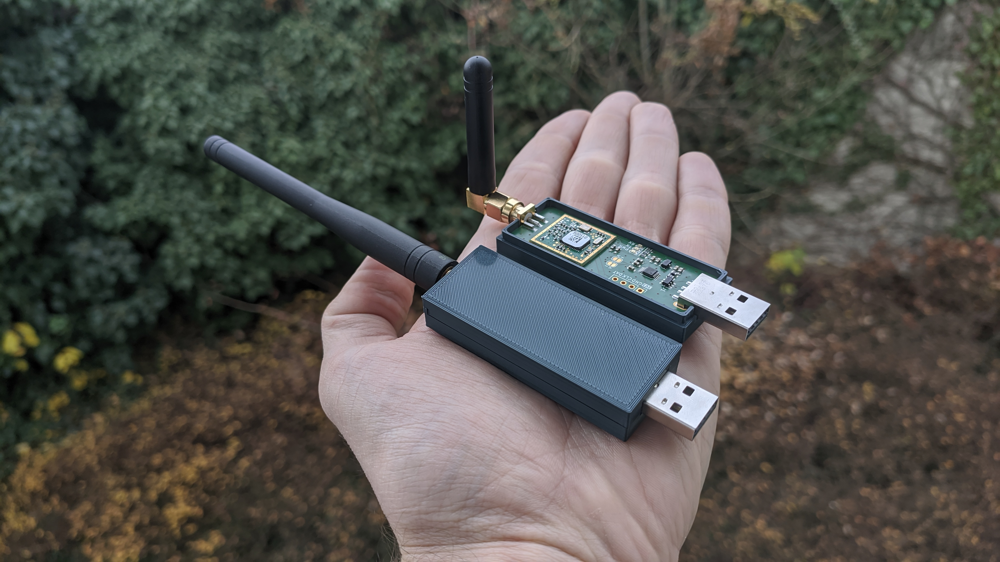
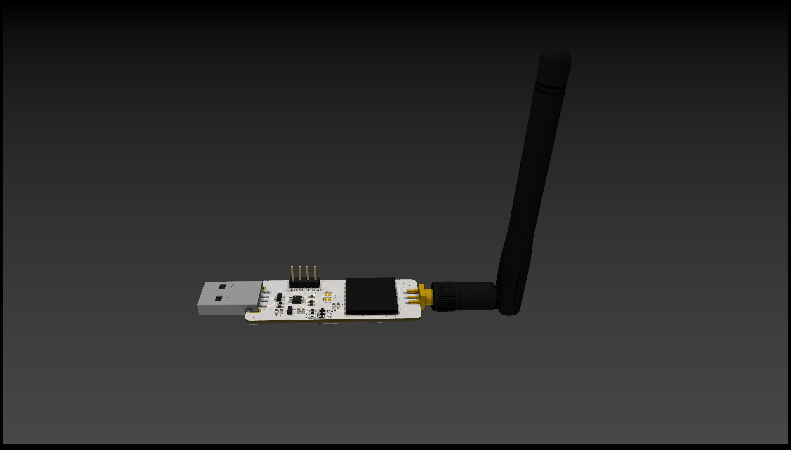
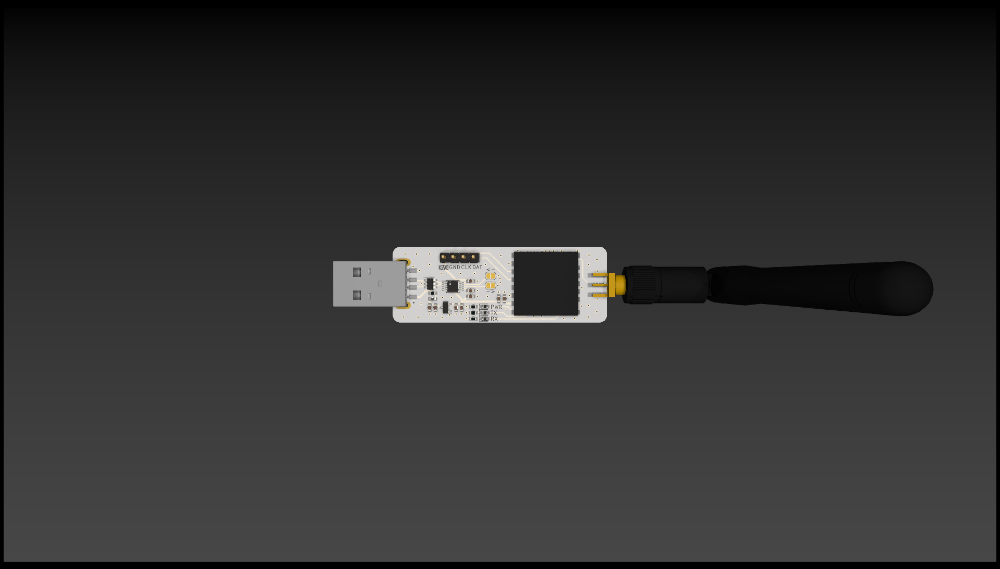

# WM-bus to USB board
* KiCAD 6.X required 
* iM871A module
* includes USB ESD protection
* includes CH340E UART IC

## Software
Tested with https://github.com/weetmuts/wmbusmeters library.

## Board overview

